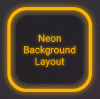
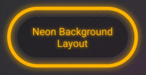
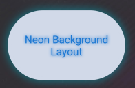
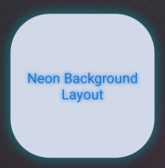
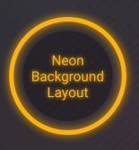
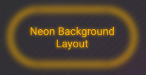
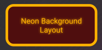
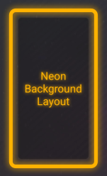

# NeonLightBackgroundLayout
A Layout That helps you create a glowing neon light effect as the background of it's children.

#### Gradle:
**Step 1.** Add it in your root build.gradle at the end of repositories:

	allprojects {
		repositories {
			...
			maven { url 'https://jitpack.io' }
		}
	}
**Step 2.** Add the dependency

	dependencies {
	        implementation 'com.github.mr-sarsarabi:NeonLightBackgroundLayout:1.0.4'
	}

#### Maven:

**Step 1.** Add the JitPack repository to your build file

	<repositories>
		<repository>
		    <id>jitpack.io</id>
		    <url>https://jitpack.io</url>
		</repository>
	</repositories>

**Step 2.** Add the dependency

	<dependency>
	    <groupId>com.github.mr-sarsarabi</groupId>
	    <artifactId>NeonLightBackgroundLayout</artifactId>
	    <version>v1.0.4</version>
	</dependency>

### Usage

Look at sample app for more details.

    <com.MirageStudios.library.NeonBackgroundLayout
            android:layout_width="250dp"
            android:layout_height="250dp"
            android:layout_gravity="center"
            android:padding="48dp"
            app:neon_cornerRadius="16dp"
            app:neon_innerBackgroundColor="#48000000"
            app:neon_innerBackgroundPadding="6dp"
            app:neon_leftPadding="4dp"
            app:neon_rightPadding="4dp"
            app:neon_topPadding="4dp"
            app:neon_bottomPadding="4dp"
            app:neon_shadowColor="#FFB300"
            app:neon_shadowMultiplier="1.5"
            app:neon_strokeColor="#FFB300"
            app:neon_strokeWidth="3dp"
            app:neon_style="style_stroke_with_inner_background_and_shadow">
            
    </com.MirageStudios.library.NeonBackgroundLayout>
    
#### Notes:
1. There are 3 main bodies in the generated background: `shadow` - `stroke` - `innerBackground`
2. You can enable or disable each of the bodies using the `neon_style` attribute.
3. You can change the color of each body using it's color attribute.
4. If you want a circular background instead of a rectangle with rounded corners, just give a high value to `neon_cornerRadius` attribute. Like `999dp`.
5. The inner background body can have a padding from the stroke. Use `neon_innerBackgroundPadding` attribute for that.
6. You can control the width of the stroke body using the `neon_strokeWidth` attribute.
7. The `neon_shadowMultiplier` attribute is a float variable and is used in calculating the shadow blur radius:

  `blurRadius = strokeWidth * shadowMultiplier`.

8. There are 5 padding attributes that give your specified space around all of the body shapes. If you use the main `neon_padding` attribute the other 4 will get ignored.
9. Note that these 4 padding attributes are separate from the original view's padding attributes. These padding attrs start with `neon_`. Like `neon_rightPadding`

I will try to add the java methods soon.

##### Other Possible Outputs

